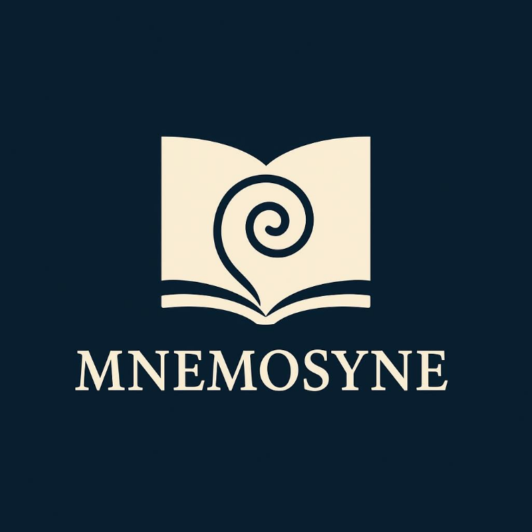

# SAE301
Sujet de M. Hébert  - Mnémosyne

> **"Garder la mémoire, éclairer les parcours."**

## 📄 Contexte

Depuis la réforme de septembre 2021, les IUT ont basculé vers le **Bachelor Universitaire de Technologie (BUT)**. Cette transition a introduit de nouveaux parcours, une approche par compétences (SAÉ) et une complexité accrue dans le suivi de la scolarité.

Ce projet a été développé pour l'**IUT de Villetaneuse** qui compte 6 départements (CJ, GEA, GEII, INFO, RT, SD)  sans oublier les passerelles. Il répond à un besoin crucial de l'institution, du rectorat et du ministère : **le suivi des cohortes**.

Une *cohorte* désigne l'ensemble des étudiants commençant une formation donnée la même année et suivant leur parcours ensemble. Mnémosyne permet de visualiser ce flux complexe sur les 3 années du diplôme.

## ✨ Fonctionnalités

La plateforme est divisée en deux espaces distincts :

### 👁️ Espace consultation (Visualisation)
L'interface permet aux utilisateurs de visualiser les parcours étudiants via des **diagrammes de Sankey**.

* **Filtres dynamiques :** Choix par année de promotion et par département (ou vision globale "Tout l'IUT").
* **Visualisation des flux :** Représentation graphique des passages (BUT1 -> BUT2), redoublements, et abandons.
* **Interactivité :**
    * Clic sur un flux pour "driller" (ex: suivre spécifiquement les redoublants).
    * Affichage des décisions de jury (ADM, PASD, RED, NAR, ADJ).

### ⚙️ Espace administration
Réservé à la gestion des données et des règles métier.

* **Synchronisation API :** Bouton pour charger/mettre à jour les données depuis l'API ScoDoc.
* **Gestion des Scénarii :** Configuration des cas particuliers

## 🛠️ Stack technique

* **Frontend :** HTML5, CSS3, JavaScript (Bibliothèque de visualisation Sankey).
* **Backend :** Flask (envisage de migrer vers du PHP).
* **Base de Données :** SQLite3.
* **Source de données :** API [ScoDoc 9](https://scodoc.org/ScoDoc9API/).

> **Note sur la confidentialité :** L'accès à l'API de production de l'IUT est restreint. L'environnement de développement utilise des jeux de données anonymisé au format JSON pour simuler les réponses de l'API tout en respectant le RGPD.

## 📊 Terminologie et codes (ScoDoc)

L'application traite les codes de décision de jury suivants :

| Code | Signification |
| :--- | :--- |
| **ADM** | Admis (toutes compétences validées) |
| **PASD** | Passage sans toutes les compétences (dette) |
| **RED** | Redoublement |
| **NAR** | Non Admis / Réorientation (abandon) |
| **ADJ** | Admis par Jury |

## 🚀 Installation et démarrage

en cours...

## 👥 Auteurs et Contributions

Projet réalisé dans le cadre de l'IUT de Villetaneuse.
(mettre les @ de tout le monde)

---
*Mnémosyne est, dans la mythologie grecque, la déesse de la mémoire et mère des Muses.*
